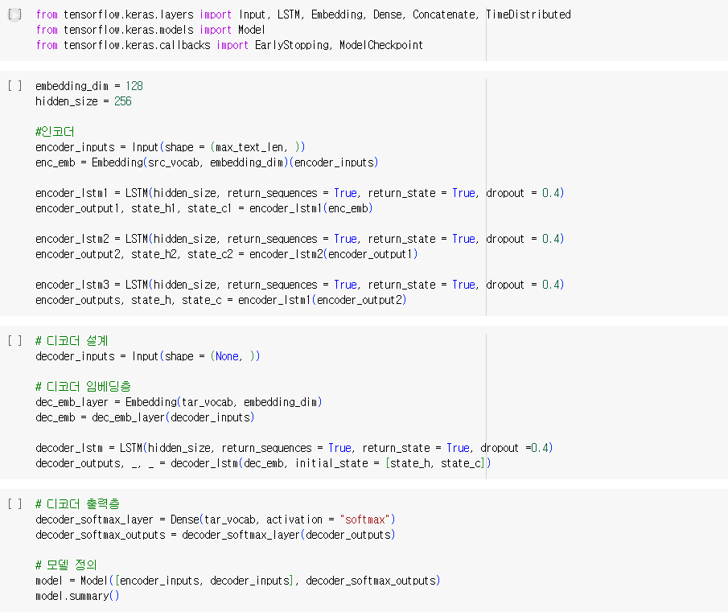
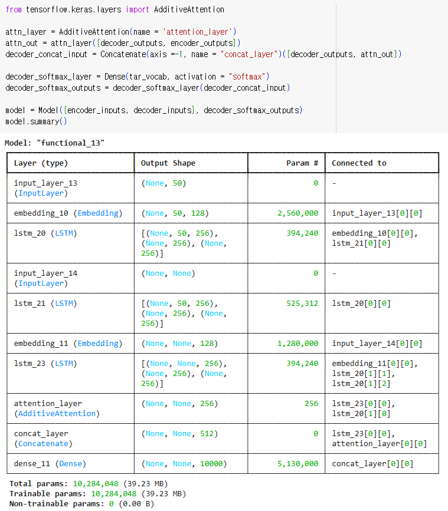
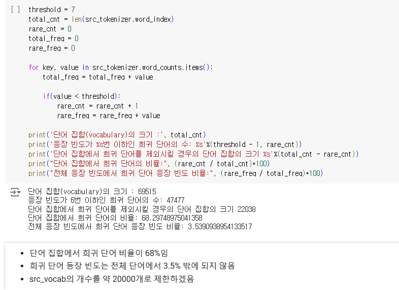
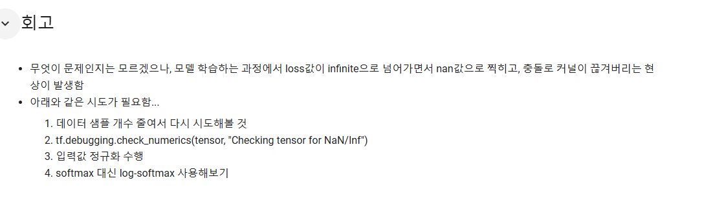
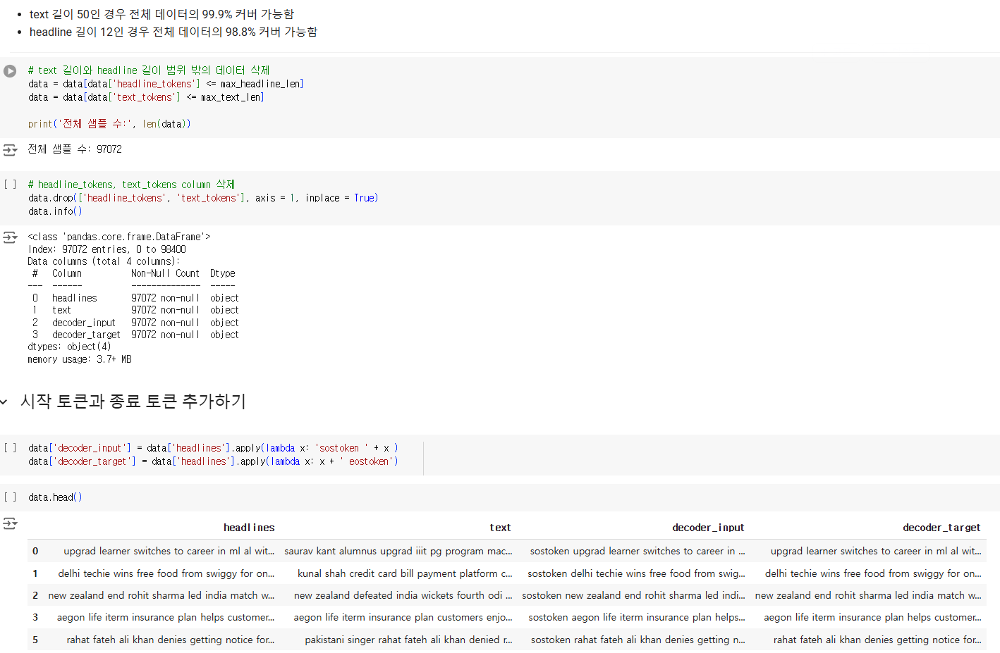
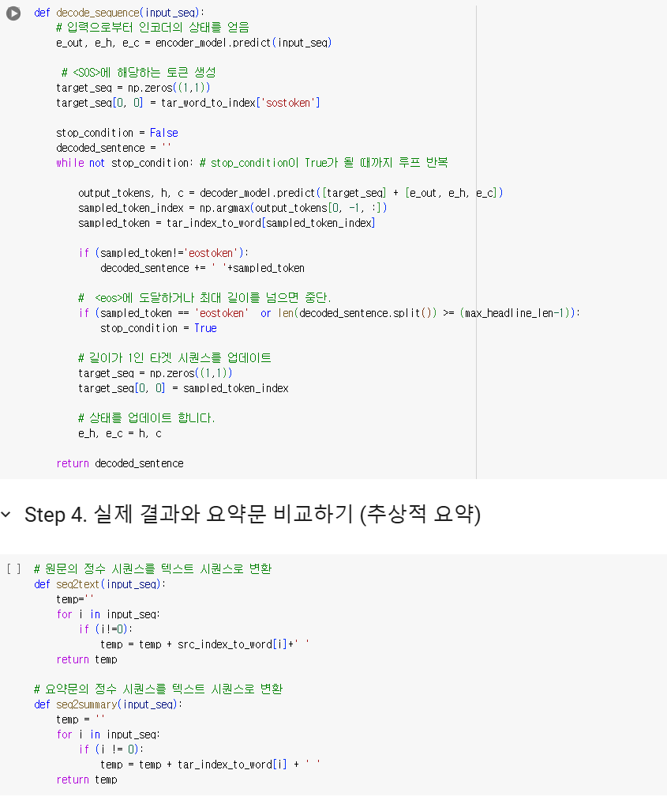

# AIFFEL Campus Online Code Peer Review Templete
- 코더 : 박세희
- 리뷰어 : 윤수영


# PRT(Peer Review Template)
- [O]  **1. 주어진 문제를 해결하는 완성된 코드가 제출되었나요?**
    - 문제에서 요구하는 최종 결과물이 첨부되었는지 확인
        - 중요! 해당 조건을 만족하는 부분을 캡쳐해 근거로 첨부


        - 모델 구축 및 callback 까지 설정을 완료하였으며, 데이터의 모든 전처리를 마친 것으로 확인됨
        - 모델의 학습에서 약간의 에러가 있어서 해당 부분만 디버깅하면 LMS에서 요구하는 과제를 모두 수행한 것으로 확인됨


         


         


         
    


- [O]  **2. 전체 코드에서 가장 핵심적이거나 가장 복잡하고 이해하기 어려운 부분에 작성된 
주석 또는 doc string을 보고 해당 코드가 잘 이해되었나요?**
    - 해당 코드 블럭을 왜 핵심적이라고 생각하는지 확인
    - 해당 코드 블럭에 doc string/annotation이 달려 있는지 확인
    - 해당 코드의 기능, 존재 이유, 작동 원리 등을 기술했는지 확인
    - 주석을 보고 코드 이해가 잘 되었는지 확인
        - 중요! 잘 작성되었다고 생각되는 부분을 캡쳐해 근거로 첨부

        - 아래 사진과 같이 마크다운 언어를 사용하여 워크 플로우를 잘 정리하였음


         

        
        
- [O]  **3. 에러가 난 부분을 디버깅하여 문제를 해결한 기록을 남겼거나
새로운 시도 또는 추가 실험을 수행해봤나요?**
    - 문제 원인 및 해결 과정을 잘 기록하였는지 확인
    - 프로젝트 평가 기준에 더해 추가적으로 수행한 나만의 시도, 
    실험이 기록되어 있는지 확인
        - 중요! 잘 작성되었다고 생각되는 부분을 캡쳐해 근거로 첨부


        - 아래 사진에서 확인 가능하듯, 회고에 작성하여 두었음


            


        
- [O]  **4. 회고를 잘 작성했나요?**
    - 주어진 문제를 해결하는 완성된 코드 내지 프로젝트 결과물에 대해
    배운점과 아쉬운점, 느낀점 등이 기록되어 있는지 확인
    - 전체 코드 실행 플로우를 그래프로 그려서 이해를 돕고 있는지 확인
        - 중요! 잘 작성되었다고 생각되는 부분을 캡쳐해 근거로 첨부


        - 아래 사진과 같이 회고를 잘 작성하였음


         


         


        
- [O]  **5. 코드가 간결하고 효율적인가요?**
    - 파이썬 스타일 가이드 (PEP8) 를 준수하였는지 확인
    - 코드 중복을 최소화하고 범용적으로 사용할 수 있도록 함수화/모듈화했는지 확인
        - 중요! 잘 작성되었다고 생각되는 부분을 캡쳐해 근거로 첨부


        - 아래 사진과 같이 반복적인 부분에 대하여 함수를 사용하여 정리하였음


         


# 회고(참고 링크 및 코드 개선)
```
# 리뷰어의 회고를 작성합니다.
# 코드 리뷰 시 참고한 링크가 있다면 링크와 간략한 설명을 첨부합니다.
# 코드 리뷰를 통해 개선한 코드가 있다면 코드와 간략한 설명을 첨부합니다.
```
- 주석을 많이 달고 전체적으로 정리를 잘 해두셔서 코드 이해가 잘 됩니다.
- early stop이 아닌 check point를 callback 함수에 사용한 부분이 매우 인상 깊습니다. 저도 시도해보겠습니다.
- 회고에 향후 진행할 부분에 대하여 고찰하고 작성하신 부분이 인상 깊습니다. 특히 optimazer를 바꾸어 시도하고자 계획한 부분 배워갑니다.
- 학습 모델의 decorder layer를 추가해서 한번 다시 학습해보는 것도 추천드립니다. (본인의 경우 같은 단어가 중복되는 문제가 발생하였음)
